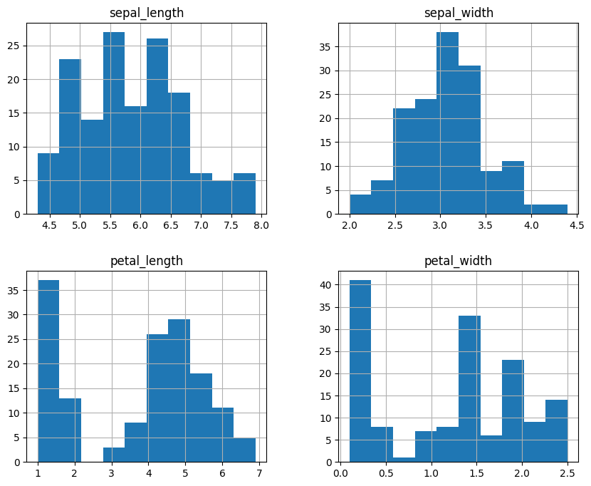
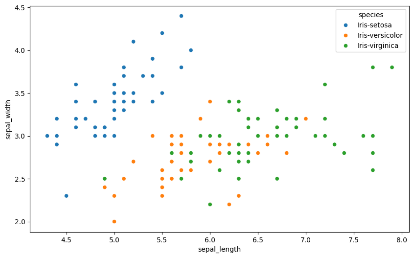

# Data Understanding

Data Understanding adalah tahap awal untuk melakukan pengukuran dan pemahaman terhadap data. Proses ini melibatkan integrasi data dari berbagai format seperti XML, JSON, atau basis data lainnya. Setelah data terkumpul, langkah krusial berikutnya adalah membersihkan data untuk menjaga kualitas analisis.

### Kualitas dan Kebersihan Data

Data yang kotor dapat menghambat proses penambangan data. Beberapa jenis data kotor yang sering ditemui antara lain:
1. Redudansi data: Kondisi di mana terdapat data yang berulang atau duplikat dalam dataset.
2. Data tidak konsisten: Kondisi di mana data memiliki format atau nilai yang berbeda untuk informasi yang sama.

Kualitas data dapat dinilai dari ada tidaknya nilai yang hilang (missing values) dan data duplikat. Missing values dapat ditoleransi jika jumlahnya kurang dari 10 persen dari total data.

### Komponen Utama Memahami Data

Terdapat empat komponen utama dalam memahami data:
1. Penumpukan data awal: Proses pengumpulan data mentah dari berbagai sumber.
2. Deskripsi data: Memberikan gambaran umum mengenai karakteristik data yang dimiliki.
3. Eksplorasi data: Melakukan pencarian pola atau hubungan awal antar variabel melalui analisis statistik atau visualisasi.
4. Kualitas data: Memastikan data sudah layak dan bersih untuk diproses lebih lanjut.

### Struktur Data dan Seleksi Fitur

Data tabular memiliki struktur yang terdiri dari baris dan kolom. Dalam proses analisis, dilakukan seleksi fitur untuk mengurangi jumlah kolom atau variabel yang tidak relevan. Semua variabel yang ada perlu diseleksi untuk memastikan model yang dibangun efektif.

Dalam penulisan ilmiah atau skripsi, jumlah data harus dinyatakan secara pasti dan tegas. Penggunaan kata "kira-kira" harus dihindari untuk menjaga validitas informasi.

### Teknik Analisis dan Pemodelan

Dalam data understanding, dilakukan Eksplorasi Data Analisis (EDA) untuk melihat hubungan antar variabel. Beberapa teknik yang digunakan antara lain:
1. Regresi Linier: Pendekatan rumus dengan melihat pola kumpulan data yang membentuk garis lurus.
2. Regresi Non Linier: Pendekatan di mana pola data tidak lurus melainkan memiliki bentuk yang berbelok-belok.
3. Scatter Plot: Digunakan untuk melihat persebaran data dan korelasi antar variabel.
4. Histogram: Digunakan untuk melihat distribusi frekuensi dari data.
5. Outlier: Deteksi terhadap data yang memiliki nilai sangat jauh berbeda dari kumpulan data lainnya.

### Sumber dan Tipe Data

Data dapat diperoleh dari berbagai sumber seperti database perusahaan, media sosial, rekaman log sistem, atau hasil survei. Tipe data yang umum ditemui meliputi:
1. Biner: Terdiri dari biner simetris (tidak ada penekanan pada salah satu kategori, contoh: jenis kelamin) dan biner asimetris (terdapat penekanan pada salah satu kategori, contoh: hasil tes kesehatan).
2. Kategorikal: Data yang memiliki lebih dari tiga opsi kategori.
3. Numerik: Data yang merupakan hasil dari pengujian atau pengukuran angka secara langsung.

### Implementasi Google Colab

Berikut adalah kode lengkap untuk melakukan eksplorasi data secara menyeluruh di Google Colab:

```python
!pip install pandas seaborn matplotlib numpy

import pandas as pd
import seaborn as sns
import matplotlib.pyplot as plt
import numpy as np
from google.colab import files

print("Silakan pilih file CSV kamu:")
uploaded = files.upload()
file_path = list(uploaded.keys())[0]
df = pd.read_csv(file_path)

print("\n=== STRUKTUR DATA ===")
display(df.head())

print("\n=== STATISTIK DESKRIPTIF ===")
display(df.describe())

print("\n=== ANALISIS KUALITAS DATA ===")
print(f"Data Duplikat: {df.duplicated().sum()}")
print("\nMissing Values:")
print(df.isnull().sum())

plt.figure(figsize=(10, 6))
sns.scatterplot(data=df, x=df.columns[0], y=df.columns[1], hue=df.columns[-1])
plt.title('Scatter Plot Hubungan Variabel')
plt.show()

df.hist(figsize=(10, 8))
plt.show()
```

**Hasil Output (Tabel head):**

| index | sepal_length | sepal_width | petal_length | petal_width | species |
| :-- | :-- | :-- | :-- | :-- | :-- |
| 0 | 5.1 | 3.5 | 1.4 | 0.2 | Iris-setosa |
| 1 | 4.9 | 3.0 | 1.4 | 0.2 | Iris-setosa |
| 2 | 4.7 | 3.2 | 1.3 | 0.2 | Iris-setosa |
| 3 | 4.6 | 3.1 | 1.5 | 0.2 | Iris-setosa |
| 4 | 5.0 | 3.6 | 1.4 | 0.2 | Iris-setosa |

**Hasil Output (Tabel Statistik Deskriptif):**

| | sepal_length | sepal_width | petal_length | petal_width |
| :-- | :-- | :-- | :-- | :-- |
| **count** | 150.000000 | 150.000000 | 150.000000 | 150.000000 |
| **mean** | 5.843333 | 3.054000 | 3.758667 | 1.198667 |
| **std** | 0.828066 | 0.433594 | 1.764420 | 0.763161 |
| **min** | 4.300000 | 2.000000 | 1.000000 | 0.100000 |
| **25%** | 5.100000 | 2.800000 | 1.600000 | 0.300000 |
| **50%** | 5.800000 | 3.000000 | 4.350000 | 1.300000 |
| **75%** | 6.400000 | 3.300000 | 5.100000 | 1.800000 |
| **max** | 7.900000 | 4.400000 | 6.900000 | 2.500000 |

**Hasil Output Analisis Kualitas:**

**=== ANALISIS KUALITAS DATA ===**
* **Data Duplikat:** 3

| Atribut | Jumlah Missing Value |
| :-- | :-- |
| sepal_length | 0 |
| sepal_width | 0 |
| petal_length | 0 |
| petal_width | 0 |
| species | 0 |

**Visualisasi Google Colab:**

**- Statistik Deskriptif (Colab):**


**- Scatter Plot (Colab):**


### Implementasi Menggunakan Orange Data Mining

Selain melalui kode, eksplorasi data juga dapat dilakukan dengan Orange Data Mining menggunakan sistem tarik-lepas (*drag and drop*) widget.

**Flow Orange:**


Langkah-langkah di Orange:
1.  **File**: Digunakan untuk mengimpor file CSV atau database lokal.
2.  **Data Table**: Untuk memverifikasi jumlah baris, kolom, dan isi data.
3.  **Distributions**: Untuk melihat grafik batang dan distribusi frekuensi data.
4.  **Scatter Plot**: Untuk mendeteksi tren dan pengelompokan spesies secara visual.
5.  **Box Plot**: Untuk memantau rentang nilai dan mendeteksi pencilan (*outlier*).

**Visualisasi Orange Data Mining:**

**1. Impor Data:**


**2. Statistik Kolom:**


**3. Distribusi Fitur:**


**4. Scatter Plot:**

