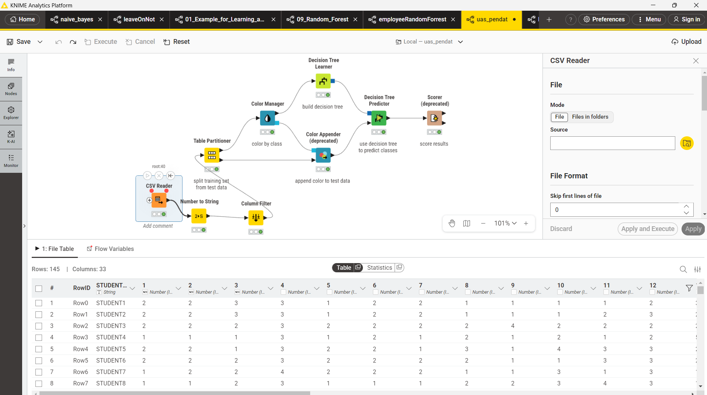
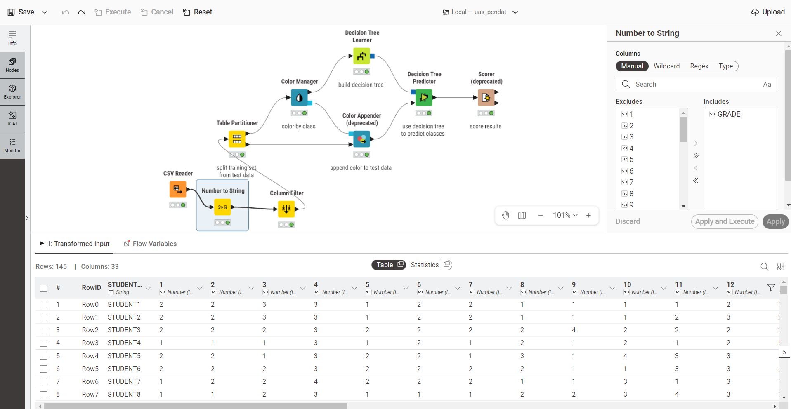
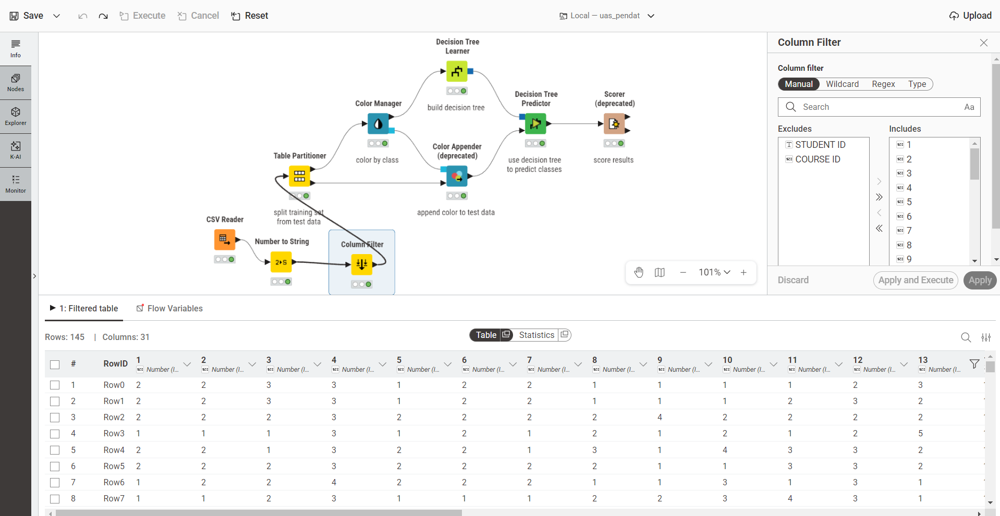
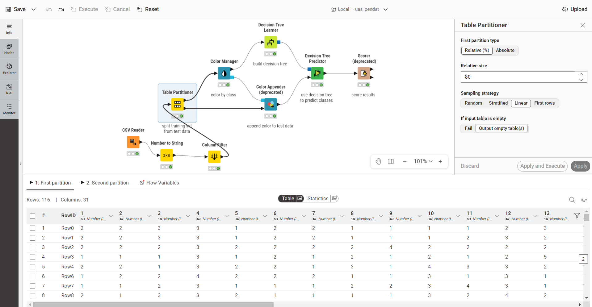
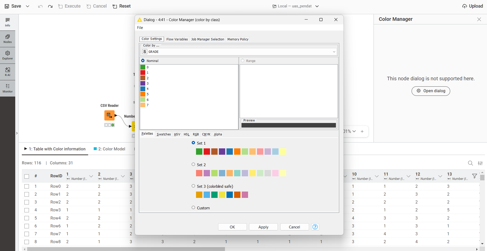
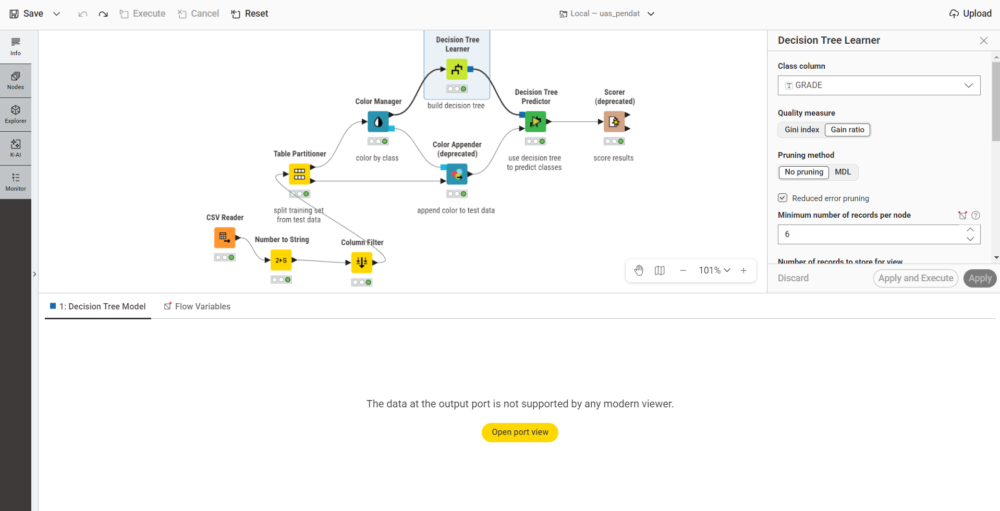
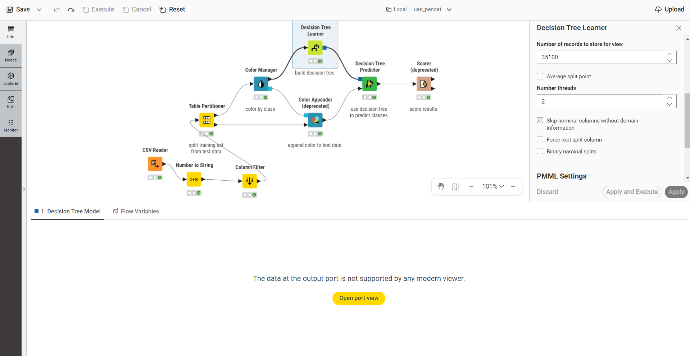
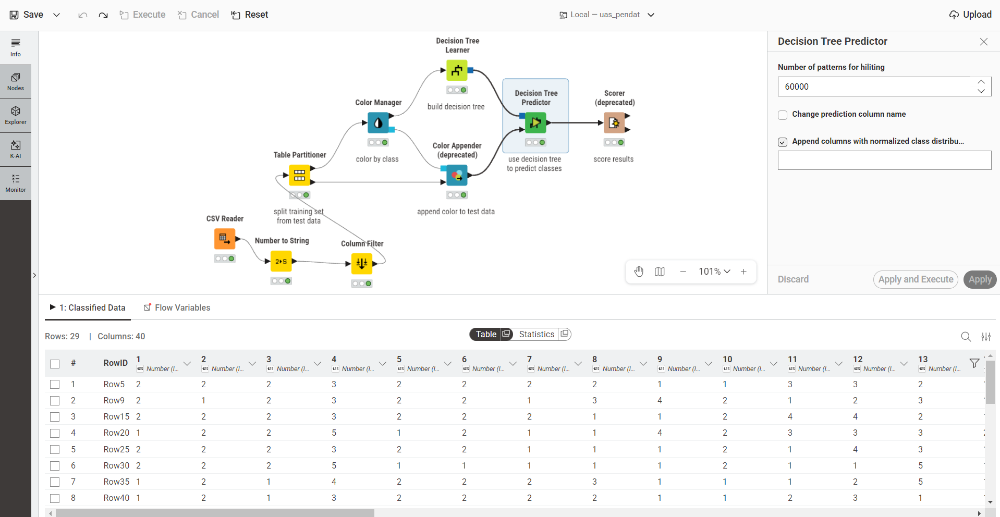
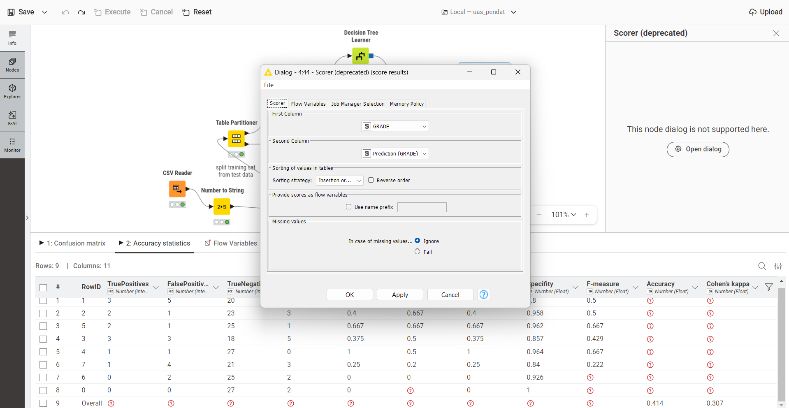

# Klasifikasi Performa Akademik Mahasiswa (GRADE) Menggunakan Decision Tree di KNIME

## Latar Belakang

Evaluasi performa akademik mahasiswa di perguruan tinggi tidak hanya ditentukan oleh nilai ujian, tetapi juga dipengaruhi oleh berbagai faktor lain seperti kondisi keluarga, kebiasaan belajar, status sosial-ekonomi, hingga gaya hidup mahasiswa selama menjalani perkuliahan. Memahami pola hubungan antara faktor-faktor tersebut dengan hasil akhir (GRADE) yang diperoleh mahasiswa menjadi penting bagi institusi pendidikan, baik untuk keperluan evaluasi kurikulum maupun untuk mendeteksi dini mahasiswa yang berisiko mendapatkan nilai rendah.

Salah satu pendekatan yang dapat digunakan untuk memodelkan hubungan tersebut adalah **klasifikasi** menggunakan teknik *machine learning*. Pada penelitian ini digunakan algoritma **Decision Tree (Pohon Keputusan)** karena sifatnya yang mudah diinterpretasikan - hasil klasifikasi dapat divisualisasikan dalam bentuk pohon keputusan sehingga faktor-faktor yang mempengaruhi nilai akhir mahasiswa dapat dijelaskan secara visual dan lebih mudah dipahami dibandingkan metode lain seperti Naive Bayes.

Proses klasifikasi dibangun menggunakan **KNIME Analytics Platform**, sebuah perangkat *low-code* untuk membangun *workflow* data science tanpa harus menulis banyak kode pemrograman.

---

## Metode yang Digunakan dan Alasan Pemilihannya

Penelitian ini menggunakan metode klasifikasi dengan algoritma **Decision Tree (Pohon Keputusan)**. Klasifikasi adalah teknik dalam *machine learning* untuk memprediksi kategori kelas dari suatu data. Dalam konteks ini, tujuannya adalah memprediksi kategori performa akademik atau nilai akhir (GRADE) dari mahasiswa.

Beberapa alasan utama mengapa metode **Decision Tree** dipilih untuk studi kasus ini adalah:

1. **Mudah Diinterpretasikan (*White-Box Model*)**: *Decision Tree* menghasilkan aturan (*rules*) berbasis kondisi *IF-THEN* yang jelas. Pihak institusi pendidikan dapat dengan mudah melacak alur keputusan untuk melihat kondisi atau faktor apa saja yang menyebabkan seorang mahasiswa mendapat nilai tinggi atau rendah.
2. **Visualisasi yang Intuitif**: Model ini dapat direpresentasikan secara visual dalam bentuk diagram pohon (akar, cabang, dan daun), menjadikannya sangat mudah dipahami meskipun oleh audiens non-teknis.
3. **Mampu Menangani Data Kategorikal dan Numerik**: Dataset penelitian banyak berisi hasil kuesioner dengan tipe data ordinal atau kategorikal. *Decision Tree* sangat baik dalam menangani tipe data tersebut tanpa memerlukan banyak pra-pemrosesan.
4. **Seleksi Fitur Otomatis**: Dalam proses pembentukan pohon, algoritma ini secara otomatis menempatkan atribut yang paling berdampak besar terhadap GRADE pada bagian atas (mendekati akar). Hal ini membantu peneliti langsung mengetahui faktor mana (misalnya: kehadiran, jam belajar, dll.) yang paling dominan mempengaruhi performa mahasiswa.

---

## Dataset yang Digunakan

| Atribut              | Keterangan                                                                                  |
| -------------------- | --------------------------------------------------------------------------------------------- |
| Sumber               | UCI Machine Learning Repository - *Higher Education Students Performance Evaluation*          |
| Tautan               | https://archive.ics.uci.edu/dataset/856/higher+education+students+performance+evaluation      |
| Donasi               | 14 Agustus 2023, oleh Nevriye Yilmaz & Boran Şekeroğlu (Near East University)                  |
| Asal data            | Mahasiswa Fakultas Teknik (*Faculty of Engineering*) dan Fakultas Ilmu Pendidikan (*Faculty of Educational Sciences*), dikumpulkan tahun 2019 |
| Jumlah Instance      | 145 baris data mahasiswa                                                                      |
| Jumlah Fitur         | 31 fitur + 1 kolom ID + 1 kolom target (GRADE)                                                |
| Jenis Data           | Integer / kategorikal (hasil dari kuesioner berskala)                                          |
| Missing Value        | Tidak ada                                                                                      |
| Tipe Tugas           | Klasifikasi (*Classification*)                                                                |
| Variabel Target      | **GRADE** - nilai akhir mata kuliah (0: Fail, 1: DD, 2: DC, 3: CC, 4: CB, 5: BB, 6: BA, 7: AA) |
| Format File          | `.csv`                                                                                         |
| Lisensi              | CC BY 4.0                                                                                      |

Dataset ini berisi jawaban kuesioner mahasiswa yang dikelompokkan menjadi tiga kategori besar:

* **Pertanyaan ke-1 s.d. 10** => data personal (usia, jenis kelamin, jenis SMA asal, beasiswa, pekerjaan tambahan, dll.)
* **Pertanyaan ke-11 s.d. 16** => data keluarga (pendidikan dan pekerjaan orang tua, status pernikahan orang tua, jumlah saudara, dll.)
* **Pertanyaan ke-17 s.d. 30** => kebiasaan belajar (jam belajar per minggu, frekuensi membaca, kehadiran kuliah, cara belajar untuk ujian, dll.)

Beberapa contoh fitur penting dalam dataset:

| No | Variabel                                  | Keterangan Skala                                                              |
| -- | ------------------------------------------ | ------------------------------------------------------------------------------ |
| 1  | Student Age                               | 1: 18-21, 2: 22-25, 3: di atas 26                                              |
| 2  | Sex                                       | 1: perempuan, 2: laki-laki                                                     |
| 4  | Scholarship type                          | 1: tidak ada, 2: 25%, 3: 50%, 4: 75%, 5: penuh                                 |
| 17 | Weekly study hours                        | 1: tidak ada, 2: <5 jam, 3: 6-10 jam, 4: 11-20 jam, 5: lebih dari 20 jam       |
| 22 | Attendance to classes                     | 1: selalu, 2: kadang-kadang, 3: tidak pernah                                   |
| 29 | Cumulative GPA semester lalu (skala 4.00) | 1: <2.00, 2: 2.00-2.49, 3: 2.50-2.99, 4: 3.00-3.49, 5: di atas 3.49           |
| 32 | **GRADE (target)**                        | 0: Fail, 1: DD, 2: DC, 3: CC, 4: CB, 5: BB, 6: BA, 7: AA                       |

> Catatan: kolom **Student ID** dan **Course ID** turut tersedia dalam dataset namun hanya berfungsi sebagai identitas data, bukan atribut prediktif.

---

## Alur Kerja (Pipeline) di KNIME

Seluruh proses dibangun dalam satu *workflow* KNIME bernama `uas_pendat` dengan urutan node sebagai berikut:

```
CSV Reader
    ↓
Number to String
    ↓
Column Filter
    ↓
Table Partitioner (80:20, Linear)
    ↓
Color Manager
    ↓
Decision Tree Learner
    ↓
Decision Tree Predictor
    ↓
Scorer (deprecated)
```

---

## Implementasi Node KNIME

### 1. CSV Reader

**Fungsi:** Membaca dataset CSV (`DATA.csv` hasil unduhan dari UCI Repository) ke dalam KNIME sebagai data table awal. Node ini dipakai karena dataset memang sudah tersedia dalam format CSV, dan KNIME bisa mendeteksi tipe data tiap kolom secara otomatis saat file dibaca. Node ini menjadi titik masuk data untuk seluruh proses klasifikasi yang dibangun setelahnya.

Hasil pembacaan menghasilkan **145 baris data dengan 33 kolom** (31 fitur + STUDENT ID + COURSE ID, ditambah kolom GRADE sebagai target).



---

### 2. Number to String

**Kolom yang diubah:** `GRADE`

GRADE merupakan target klasifikasi. Karena nilainya berbentuk angka (0-7), KNIME secara default akan membaca kolom ini sebagai tipe numerik (Number). Padahal tujuan penelitian adalah:

> Mengelompokkan data ke dalam kategori nilai (GRADE), bukan melakukan regresi terhadap nilai numeriknya.

Karena itu kolom GRADE diubah dari tipe Number menjadi **String/Nominal** agar dikenali oleh node Decision Tree Learner sebagai kelas/label klasifikasi, bukan nilai kontinu yang diregresikan.



---

### 3. Column Filter

**Kolom yang dihapus:** `STUDENT ID`, `COURSE ID`

Kedua kolom tersebut (contoh nilainya: `STUDENT1`, `STUDENT2`, `STUDENT3`, ...) hanya berfungsi sebagai identitas data dan tidak mencerminkan karakteristik akademik maupun personal mahasiswa. Jika kolom identitas ini tetap disertakan dalam proses pemodelan, dampaknya justru merugikan: menambah *noise* pada data, memperbesar risiko *overfitting* karena model bisa "menghafal" ID tertentu, dan tidak memberikan kontribusi informasi apapun terhadap prediksi GRADE.

Karena itu kedua kolom identitas dihapus, sehingga data yang masuk ke proses pemodelan tersisa 31 kolom (29 fitur akademik/personal/keluarga + 1 kolom GRADE sebagai target, setelah STUDENT ID dan COURSE ID dikeluarkan).



---

### 4. Table Partitioner

**Fungsi:** Membagi dataset menjadi data *training* dan data *testing*.

**Konfigurasi:**

| Parameter             | Nilai          |
| ---------------------- | -------------- |
| First partition type   | Relative (%)   |
| Relative size           | 80              |
| Sampling strategy      | Linear          |

**Hasil pembagian** dari total 145 data:

| Partisi   | Jumlah Data |
| --------- | ----------- |
| Training  | 116 data    |
| Testing   | 29 data     |

Rasio 80:20 dipilih karena 116 baris data training sudah cukup untuk membangun model yang representatif, sementara 29 baris data testing cukup untuk mengevaluasi performanya secara objektif - dan rasio ini memang yang paling umum dipakai dalam penelitian *machine learning*.

Sampling strategy yang dipakai adalah **Linear**, bukan Random. Pada strategi Linear, data dibagi murni berdasarkan urutan baris pada tabel:

```
Baris 1-116   => Training
Baris 117-145 => Testing
```

Strategi *Random* memang secara teori lebih baik untuk mengurangi bias pengambilan sampel. Namun pada penelitian ini dipilih *Linear* karena data tidak memiliki urutan waktu (*time series*) yang harus dipertahankan secara acak, dan juga tidak diurutkan berdasarkan ranking nilai tertentu yang bisa menimbulkan bias sistematis. Strategi Linear juga memberikan hasil yang **selalu konsisten** dan **mudah direproduksi** - setiap kali *workflow* dijalankan ulang, pembagian data training/testing akan selalu sama, sehingga hasil evaluasi model dapat dibandingkan secara adil antar percobaan.



---

### 5. Color Manager

**Fungsi:** Memberi warna pada setiap kelas GRADE untuk keperluan visualisasi - mempermudah melihat sebaran kelas pada data dan membaca hasil klasifikasi secara visual, misalnya saat melihat pohon keputusan atau tabel berwarna.

**Pengaruh terhadap model:** Tidak ada. Node ini bersifat kosmetik/visualisasi saja dan **tidak mempengaruhi akurasi model**.



---

### 6. Decision Tree Learner

Node ini membangun model klasifikasi pohon keputusan dari data training. Decision Tree dipilih sebagai metode utama karena mudah dipahami secara konsep, mudah divisualisasikan dalam bentuk struktur pohon, cocok untuk kasus klasifikasi dengan target kategorikal seperti GRADE, dan dapat menjelaskan secara eksplisit faktor-faktor (atribut) apa saja yang paling mempengaruhi nilai akhir mahasiswa melalui urutan percabangan pada pohon.

**Konfigurasi lengkap node:**

| Parameter                                              | Nilai                     | Alasan                                                                                                                                                          |
| ------------------------------------------------------- | -------------------------- | ----------------------------------------------------------------------------------------------------------------------------------------------------------------- |
| Class column                                            | GRADE                      | GRADE adalah variabel target yang ingin diprediksi.                                                                                                              |
| Quality measure                                         | Gain Ratio                 | Digunakan untuk memilih atribut terbaik berdasarkan kualitas pemisahan (split) pada setiap simpul pohon.                                                                                  |
| Pruning method                                          | Reduced Error Pruning      | Memangkas cabang pohon yang terlalu spesifik agar mengurangi *overfitting* dan membuat pohon lebih sederhana sekaligus meningkatkan kemampuan generalisasi model. |
| Minimum number of records per node                     | 6                           | Nilai 6 digunakan agar setiap node memiliki jumlah data yang cukup representatif sebelum dilakukan pemecahan cabang, sehingga risiko *overfitting* dapat dikurangi - tidak terlalu kecil (rawan overfitting) namun juga tidak terlalu besar (kehilangan detail pola data). |
| Number threads                                          | 2                           | Memanfaatkan dua *thread* CPU untuk mempercepat proses pembentukan pohon keputusan.                                                                              |
| Skip nominal columns without domain information         | ✓ Dicentang                | Menghindari error apabila ada atribut kategorikal yang domainnya tidak lengkap, sehingga proses *training* tetap stabil dan model tetap dapat dibangun.          |
| Force root split column                                | ✘ Tidak dicentang          | Membiarkan algoritma memilih akar pohon (*root node*) secara otomatis berdasarkan atribut paling informatif, untuk menghindari bias dari peneliti.               |
| Binary nominal splits                                   | ✘ Tidak dicentang          | Agar kategori nominal dipisah secara alami sesuai jumlah kategorinya. Jika dipaksa biner, pohon menjadi lebih panjang dan lebih sulit diinterpretasikan.         |
| No true child strategy                                  | Return last prediction     | Jika ditemukan kombinasi atribut yang tidak sesuai dengan cabang manapun pada pohon, model tetap memberikan prediksi (tidak menghasilkan nilai kosong).          |
| Missing value strategy                                  | Last prediction            | Jika ditemukan nilai kosong pada data, model tetap dapat melakukan prediksi sehingga *workflow* tidak gagal dijalankan.                                          |




---

### 7. Decision Tree Predictor

**Fungsi:** Menggunakan model pohon keputusan yang telah dilatih (dari Decision Tree Learner) untuk memprediksi GRADE pada 29 data testing.

**Konfigurasi:**

| Parameter                                            | Nilai      |
| ------------------------------------------------------ | ---------- |
| Change prediction column name                         | Tidak       |
| Append columns with normalized class distribution     | ✓ Dicentang |

Opsi "Append columns with normalized class distribution" dicentang karena menampilkan probabilitas (tingkat keyakinan) model untuk setiap kelas GRADE pada setiap baris prediksi. Contoh ilustrasi:

| Kelas    | Probabilitas |
| -------- | ------------ |
| Grade 1  | 10%          |
| Grade 2  | 20%          |
| Grade 3  | 60%          |
| Grade 4  | 10%          |

Keuntungannya, peneliti dapat mengetahui seberapa yakin model terhadap setiap prediksi yang dihasilkan, sehingga mempermudah analisis hasil lebih lanjut. **Opsi ini tidak mempengaruhi nilai akurasi akhir model** - hanya menambahkan informasi probabilitas sebagai kolom tambahan pada output.



---

### 8. Scorer (deprecated)

**Fungsi:** Mengevaluasi performa model klasifikasi dengan membandingkan nilai aktual dan nilai hasil prediksi.

**Konfigurasi:**

| Parameter         | Nilai                  | Alasan                                                                                       |
| ------------------ | ----------------------- | ----------------------------------------------------------------------------------------------- |
| First Column       | GRADE                   | Merupakan nilai aktual (*ground truth*) dari data testing.                                       |
| Second Column      | Prediction (GRADE)      | Merupakan hasil prediksi model dari node Decision Tree Predictor.                                |
| Sorting strategy   | Insertion order (Default) | Hanya mempengaruhi tampilan urutan kelas pada confusion matrix, tidak mempengaruhi hasil evaluasi. |
| Reverse order      | Tidak dicentang          | Urutan kelas sudah sesuai sehingga tidak perlu dibalik.                                           |
| Use name prefix    | Tidak dicentang          | *Workflow* hanya memiliki satu node evaluasi sehingga prefix tambahan tidak diperlukan.           |
| Missing values     | Ignore                   | Jika ada nilai kosong pada hasil, evaluasi tetap dapat berjalan dan *workflow* tidak gagal.       |

**Kedua kolom (GRADE vs Prediction(GRADE)) dibandingkan** untuk menghitung metrik evaluasi: *Accuracy*, *Precision*, *Recall*, *F1-Score*, dan *Confusion Matrix*.



---

## Hasil Evaluasi Model

Berdasarkan output node Scorer pada tab **Accuracy Statistics**, diperoleh ringkasan performa sebagai berikut (nilai per kelas GRADE):

| Recall | Precision | Sensitivity | Specifity | F-measure |
| ------ | --------- | ----------- | --------- | --------- |
| 0.400  | 0.667     | 0.400       | 0.958     | 0.500     |
| 0.667  | 0.667     | 0.667       | 0.962     | 0.667     |
| 0.375  | 0.500     | 0.375       | 0.857     | 0.429     |
| 1.000  | 0.500     | 1.000       | 0.964     | 0.667     |
| 0.250  | 0.200     | 0.250       | 0.840     | 0.222     |
| 0.000  | 0.000     | 0.000       | 0.926     | 0.000     |

**Akurasi keseluruhan model: ± 0.414 (41,4%)**

### Interpretasi Hasil

Akurasi model berada pada kisaran 41% dengan nilai Cohen's Kappa sekitar 0.31, yang menurut interpretasi umum termasuk dalam kategori kesepakatan **lemah hingga cukup (*fair agreement*)** antara prediksi model dan nilai aktual. Beberapa hal yang menjadi catatan:

* Performa model **tidak merata di seluruh kelas GRADE** - beberapa kelas (misalnya kelas dengan recall 1.000) diprediksi dengan sangat baik, sementara kelas lain (recall 0.000) sama sekali tidak terdeteksi oleh model.
* Hal ini wajar terjadi mengingat jumlah data yang relatif kecil (145 baris, dengan hanya 29 data testing) dan kelas GRADE memiliki 8 kategori (0-7), sehingga distribusi data antar kelas kemungkinan tidak seimbang (*imbalanced*).
* Decision Tree dengan parameter *pruning* yang diterapkan (Reduced Error Pruning, minimum 6 record per node) sudah diarahkan untuk mengurangi *overfitting*, namun keterbatasan jumlah data tetap menjadi faktor utama yang membatasi akurasi model secara keseluruhan.
